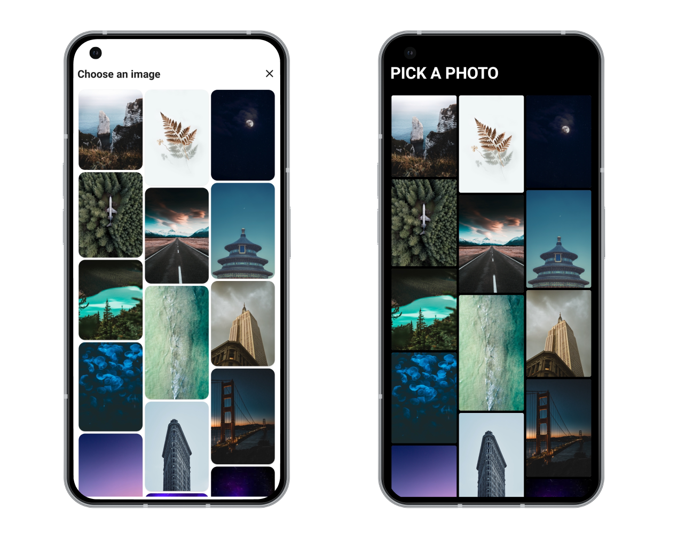

<p align="start">
  <a href="https://github.com/nabla-run/Compose-gallery-picker/blob/main/LICENSE"></a>
  <a href="https://developer.android.com/about/versions/nougat/android-7.0"></a>
</p>

Compose-gallery-picker is a library for Android Jetpack Compose that provides a gallery and an image
editor with cropping functionality based on a provided template.

## Download

Library is available on `mavenCentral()`.

```kotlin
repositories {
    mavenCentral()
}
```

```kotlin
implementation("run.nabla:gallery-picker:1.0.0")
```

## Screenshots



## Functions

The main functions provided by Compose-gallery-picker are:

#### GalleryPicker as compose component

The GalleryPicker composable displays a gallery of images for selection. It accepts various
parameters like modifier, state, primaryColor, and header. The onImageSelected callback is triggered
when an image is selected.

```kotlin
@Composable
fun GalleryPicker(
    modifier: Modifier = Modifier,
    state: GalleryPickerState = rememberGalleryPickerState(),
    primaryColor: Color = Color.Black,
    header: @Composable () -> Unit = { GalleryHeader(title = state.headerTitle) },
    onImageSelected: (Uri) -> Unit
)
```

#### GalleryPicker as activity intent

The GalleryPicker can also be used as an activity intent to launch a gallery for photo selection. In
this approach, you can utilize the rememberLauncherForActivityResult composable function to handle
the gallery contract and retrieve the selected image URI.

```kotlin
val pickPhotoLauncher = rememberLauncherForActivityResult(
    contract = GalleryContract(),
    onResult = { uri ->

    }
)

SideEffect {
    pickPhotoLauncher.launch(
        GalleryRequest.Builder()
            .setTitle("Pick one")
            .setTitleSize(25)
            .setBackgroundColor(Color.White.value.toLong())
            .setTitleColor(Color.Black.value.toLong())
            .setShowBackButton(false)
            .build()
    )
}
```

#### ImageEditor

The ImageEditor composable displays an image editor with cropping functionality. It accepts
parameters like modifier, photoState, template, templateState, primaryColor, photoURI, onDoneClick,
and footer. The onDoneClick callback is triggered when the user finishes cropping the image.

```kotlin
@Composable
fun ImageEditor(
    modifier: Modifier = Modifier,
    photoState: PhotoState = rememberPhotoState(),
    template: @Composable BoxScope.() -> Unit = {},
    templateState: TemplateState? = null,
    primaryColor: Color = Color.Black,
    photoURI: Uri,
    onDoneClick: (
        bitmap: Bitmap,
        scale: Float,
        offset: Offset,
        templateSize: Size
    ) -> Unit,
    footer: @Composable BoxScope.(
        primaryClick: () -> Unit,
    ) -> Unit,
)
```

## State Management

Both GalleryPicker and ImageEditor use state objects for managing their internal state. The state
objects GalleryPickerState, PhotoState, and TemplateState can be created using the
rememberGalleryPickerState, rememberPhotoState, and rememberTemplateState composable functions,
respectively.

## Contributing

Contributions to Compose-gallery-picker are welcome! If you find any issues or have suggestions for
improvements, please create an issue or submit a pull request.

## License

    Copyright 2023 Nable Contributors

    Licensed under the Apache License, Version 2.0 (the "License");
    you may not use this file except in compliance with the License.
    You may obtain a copy of the License at

       https://www.apache.org/licenses/LICENSE-2.0

    Unless required by applicable law or agreed to in writing, software
    distributed under the License is distributed on an "AS IS" BASIS,
    WITHOUT WARRANTIES OR CONDITIONS OF ANY KIND, either express or implied.
    See the License for the specific language governing permissions and
    limitations under the License.